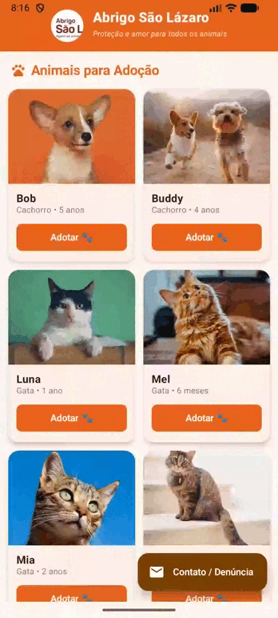
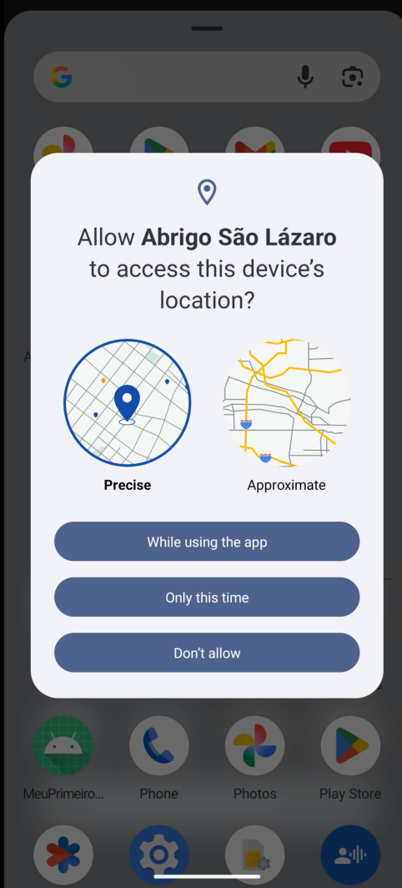
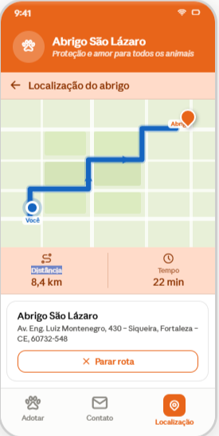
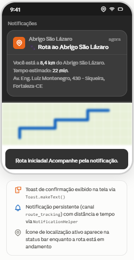

# Abrigo São Lázaro – App Android (Não Oficial)

<p align="center">
  
</p> 

Projeto desenvolvido para o módulo intermediário e avançado do curso de Android do [**Capacita iRede**](https://capacitabrasil.irede.org.br/).

Nome do aluno: Rodrigo Holanda Barbosa

Turma: 2025-2026

Descrição: Aplicativo Android desenvolvido em **Kotlin + Jetpack Compose** com propósitos de aprendizagem e de forma **Não Oficial** para o
[Abrigo São Lázaro](https://abrigosaolazaro.org.br/), o maior abrigo de proteção
animal do Ceará, fundado em 1996 em Fortaleza. A ONG acolhe cerca de 1.200 cães e gatos resgatados de situações de abandono e maus-tratos.

Justificativa: Sou apoiador da causa animal e acho relevante o tema para a sociedade.

---

## O que mudou da v1 para a v2

| Aspecto | v1 | v2 |
|---------|----|----|
| Telas | 2 (Adoção + Contato) | 3 (+ Localização) |
| Navegação | Navigation Compose | Navigation Compose + BottomNavigationBar |
| Room | INSERT + SELECT | INSERT + SELECT + UPDATE + DELETE |
| Rede | — | Retrofit 2 (2× GET + 1× POST) |
| Mapas | — | Google Maps Compose + Polyline |
| Localização | — | FusedLocationProviderClient |
| Permissões | — | Accompanist Permissions |
| Notificações | — | NotificationCompat (canal de rota) |
| Logo header | AsyncImage centralizado | `alignment = Alignment.CenterStart` (foco no brasão) |

---

## Tecnologias

| Camada | Tecnologia |
|--------|-----------|
| UI | Jetpack Compose + Material 3 |
| Navegação | Navigation Compose + BottomNavigationBar |
| Banco de dados | Room (SQLite) – CRUD completo |
| Arquitetura | MVVM (Model-View-ViewModel) |
| Imagens | Coil Compose |
| Rede | Retrofit 2 + OkHttp Logging Interceptor |
| Mapas | Google Maps Compose 4.x |
| Localização | FusedLocationProviderClient (Play Services) |
| Permissões | Accompanist Permissions |
| Notificações | NotificationCompat – canal `route_tracking` |
| Build | Gradle KTS + KSP |

---

## Estrutura do projeto

```
app/src/main/java/br/com/abrigosaolazaro/
├── AbrigoApplication.kt              # Application: Room singleton + canal de notificação
├── MainActivity.kt                   # Entry-point (enableEdgeToEdge)
│
├── data/
│   ├── db/
│   │   ├── AnimalEntity.kt           # Entidade Room (id, name, age, species, breed,
│   │   │                             #   imageUrl, description, isAvailable,
│   │   │                             #   isFavorite, viewCount)
│   │   ├── AnimalDao.kt              # GET (Flow + suspend) · INSERT · UPDATE · DELETE
│   │   └── AppDatabase.kt            # Singleton Room
│   ├── remote/
│   │   ├── api/
│   │   │   ├── MapsApiService.kt     # GET /directions · GET /geocode  (Retrofit)
│   │   │   └── ContactApiService.kt  # POST /contacts                  (Retrofit)
│   │   ├── dto/
│   │   │   └── RouteDto.kt           # DTOs: DirectionsResponse, GeocodingResponse,
│   │   │                             #       ContactRequest, ContactResponse
│   │   └── interceptor/
│   │       └── LoggingInterceptorWrapper.kt  # OkHttp logging
│   └── repository/
│       ├── AnimalRepository.kt       # Room CRUD + seed automático
│       ├── RouteRepository.kt        # 2× GET Retrofit (directions + geocode)
│       └── ContactRepository.kt      # POST Retrofit com fallback offline
│
├── util/
│   ├── PolylineDecoder.kt            # Decodifica encoded polyline do Maps (Kotlin puro)
│   └── NotificationHelper.kt         # Exibe / cancela notificação de rota
│
└── ui/
    ├── theme/
    │   ├── Color.kt                  # Paleta laranja/marrom + MapBlue
    │   ├── Type.kt                   # Tipografia
    │   └── Theme.kt                  # Light + Dark theme
    ├── navigation/
    │   └── NavGraph.kt               # 3 rotas: adoption · contact · location
    ├── components/
    │   └── ShelterHeader.kt          # Cabeçalho compartilhado (logo com CenterStart)
    └── screens/
        ├── adoption/
        │   ├── AdoptionViewModel.kt  # StateFlow com busca (debounce), favoritos, DELETE
        │   └── AdoptionScreen.kt     # Grid 2 col + barra de busca + BottomNavBar
        ├── contact/
        │   ├── ContactViewModel.kt   # POST via Retrofit + validação inline
        │   └── ContactScreen.kt      # Formulário adoção / denúncia + tela de sucesso
        └── location/
            ├── LocationViewModel.kt  # 2× GET Retrofit + estado do mapa
            └── LocationScreen.kt     # Google Maps + FusedLocation + Polyline + Notificação
```

---

## Telas

### 1. Quero Adotar (`AdoptionScreen`)
- Grid 2 colunas com os animais disponíveis no Room
- **Barra de busca** com debounce de 300 ms (consulta `Flow` do Room em tempo real)
- **Filtro de favoritos** via `FilterChip`
- Cada card: foto (Coil), nome, espécie, idade, botão ❤ (favoritar) e botão **Adotar**
- Card expansível com descrição completa (incrementa `viewCount` no Room)
- Botão **Adotar** → navega para Contato com nome do animal pré-preenchido
- `BottomNavigationBar` com 3 destinos: Adotar · Contato · Localização

### 2. Contato & Denúncia (`ContactScreen`)
- Seletor de tipo: **Adoção** ou **Denúncia de maus-tratos**
- Quando vindo do botão Adotar, o animal é pré-preenchido automaticamente
- Campos: animal, nome, e-mail, telefone, mensagem
- **POST via Retrofit** ao servidor de contato (com fallback offline gracioso)
- Loading indicator durante o envio
- Validação inline + tela de sucesso ao confirmar

### 3. Localização (`LocationScreen`) — *nova*
- **Requisição de permissão**
<p align="center">
  
</p>

- **`FusedLocationProviderClient`** obtém a posição do dispositivo em tempo real
- **GET #1** – `geocode/json`: confirma e exibe o endereço formatado do abrigo
- **GET #2** – `directions/json`: calcula rota motorizada do usuário até o abrigo
- **Polyline** decodificada (Kotlin puro) e desenhada sobre o mapa com `Polyline()`
- Chips de **distância** e **tempo estimado** exibidos abaixo do mapa
- **Toast** em cada etapa: solicitação de permissão · GPS obtido · rota calculada · erros

<p align="center">
  
</p> 

- **Notificação persistente** (canal `route_tracking`, `BigTextStyle`) disparada ao iniciar rota com a mensagem `"Rota iniciada! Acompanhe pela notificação."`, contendo distância, tempo e endereço completo
- Ícone de localização ativo na status bar enquanto a rota está em andamento
- Botão **Parar rota** cancela a notificação e limpa a polyline

<p align="center">
  
</p> 

---

## Operações Room implementadas

| Operação | Método DAO | Acionado por |
|----------|-----------|--------------|
| `INSERT` | `insertAll()` | Seed automático na 1ª execução |
| `SELECT` (Flow) | `getAvailableAnimals()` | Grid principal |
| `SELECT` (Flow) | `getFavorites()` | Filtro de favoritos |
| `SELECT` (Flow) | `searchByName()` | Barra de busca |
| `SELECT` (suspend) | `count()` | Controle de seed |
| `UPDATE` | `setFavorite()` | Botão ❤ no card |
| `UPDATE` | `incrementViewCount()` | Expandir descrição do card |
| `DELETE` | `deleteById()` | Marcar animal como adotado |
| `DELETE` | `deleteAll()` | Re-seed (utilitário) |

---

## Requisições Retrofit

| # | Método | Endpoint | Onde |
|---|--------|----------|------|
| 1 | `GET` | `maps/api/geocode/json` | `RouteRepository.geocodeShelter()` |
| 2 | `GET` | `maps/api/directions/json` | `RouteRepository.getDirections()` |
| 3 | `POST` | `/contacts` | `ContactRepository.submitContact()` |

---

## Como configurar a chave do Google Maps

1. Acesse [console.cloud.google.com](https://console.cloud.google.com)
2. Ative as APIs: **Maps SDK for Android**, **Directions API**, **Geocoding API**
3. Crie uma chave de API e copie
4. Em `gradle.properties`, substitua:
   ```
   MAPS_API_KEY=SUA_CHAVE_AQUI
   ```
5. Em `LocationScreen.kt` (constante `MAPS_API_KEY` no topo do arquivo), substitua também:
   ```kotlin
   private const val MAPS_API_KEY = "SUA_CHAVE_AQUI"
   ```

---

## Como importar no Android Studio

1. Abra o **Android Studio** (Hedgehog 2023.1.1 ou superior)
2. `File → Open` → selecione a pasta **AbrigoSaoLazaroV2**
3. Aguarde o **Gradle Sync** (certifique de não ter conflitos de atualização)
4. Configure a chave do Google Maps (passo acima)
5. Conecte um dispositivo físico ou emulador e clique em **Run ▶**

---

## Requisitos mínimos

- Android Studio Hedgehog (2023.1.1) ou superior
- JDK 17
- Android SDK: minSdk **24**, targetSdk **34**
- Google Play Services (necessário para Maps e FusedLocation)
- Chave do Google Maps com **Maps SDK for Android**, **Directions API** e **Geocoding API** habilitadas
- Conexão com internet (fotos via Coil + APIs do Maps)
